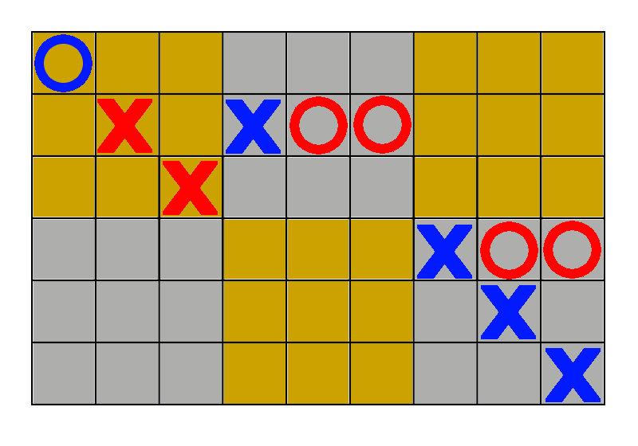
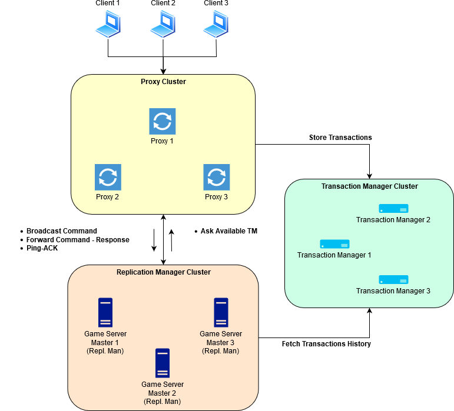

## Proyek Akhir Sistem Terdistribusi 2019
- Rahadian K. Putra 05111640000006
- Taufiq Tirtajiwangga 05111640000016
- Alcredo Simanjuntak 05111640000045
- Alfian 05111640000073

### Desain Visual Game
Struktur data yang digunakan pada board:
- List matra 3 dengan matra ke-1 menunjukkan ID dari board, matra ke-2 dan ke-3 berturut-turut adalah baris dan kolom pada board.
- List yang digunakan untuk menyimpan *ID player* dengan *write access* ke board
- *State* untuk menyimpan keadaan dari board

*Player* akan hanya dapat bermain pada satu bagian board, dimana tiap 3x3 bagian board digunakan oleh 2 *player* untuk bermain. *Player* tidak dapat meletakkan bidak pada bagian board lain.

Ilustrasi board dengan 3 permainan:
 

### Arsitektur

#### Klien
Node ini adalah player dari game Tic-Tac-Toe
#### Proxy
Node ini sebagai jembatan klien ke server game. Node ini bertugas untuk menentukan koneksi klien ke salah satu server yang tersedia. Selain itu, node ini akan mendistribusikan perintah yang dikirimkan oleh klien ke seluruh server. Perintah dari klien tersebut juga akan dikirimkan ke Transactions Manager
#### Transactions Manager
Node ini bertugas untuk menyimpan seluruh perintah/instruksi/transaksi yang pernah di-*request* oleh klien dan didistribusikan kepada Server. Format data transaksi yang disimpan adalah `<INDEX_NUM> <INSTRUCTION>`, contohnya:
```
1 PLAY userNomerSatu 1
2 PLAY userNomerDua 1
3 PUT userNomerSatu 1 1,1 # player userNomerSatu menaruh bidak di board ID 1 di koordinat (1,1)
4 PUT userNomerDua 1 1,2
...
```
#### Game Master
Node ini tempat di mana *state* game berada dan proses yang berkaitan dengan jalannya game
### Data Consistency Protocol
#### Replication
1. Klien mengirimkan perintah/instruksi kepada Server melalui Proxy
2. Perintah akan masuk ke *queue* yang berada di Proxy
3. Setiap perintah yang ada di *queue* akan di-*dequeue* dan didistribusikan ke seluruh server yang tersedia/*up* dan juga ke Transactions Manager untuk di-*track*
4. Perintah yang dikirim ke Server akan diproses sesuai dengan protokol game Tic-Tac-Toe yang telah ditentukan
5. Seluruh Server menyimpan *state* yang sama sekarang
#### Failover Recovery
1. Server yang baru saja *down* dan di-*restart* akan bertanya URI Transactions Manager kepada Proxy
2. Server membangun koneksi dengan Transaction Manager dan menyatakan dirinya NOT READY
3. Kepada Transactions Manager, Server bertanya seluruh perintah yang sudah dieksekusi secara berurutan
4. Secara berurutan, Server akan mengeksekusi satu per satu perintah yang sebelumnya sudah dieksekusi oleh Server lain
5. Server bertanya kembali ke Transactions Manager mengenai jumlah perintah yang tersimpan di Transactions Manager
6. Jika jumlahnya sama dengan perintah yang dieksekusi oleh Server, maka ke no. 8; Jika tidak, ke no. 7
7. Ambil sisa perintah yang belum ter-*fetch* oleh Server di Transactions Manager. Kembali ke no. 5
8. *Recovery* sudah sukses dilaksanakan, Server menyatakan dirinya READY dan siap untuk menerima koneksi
